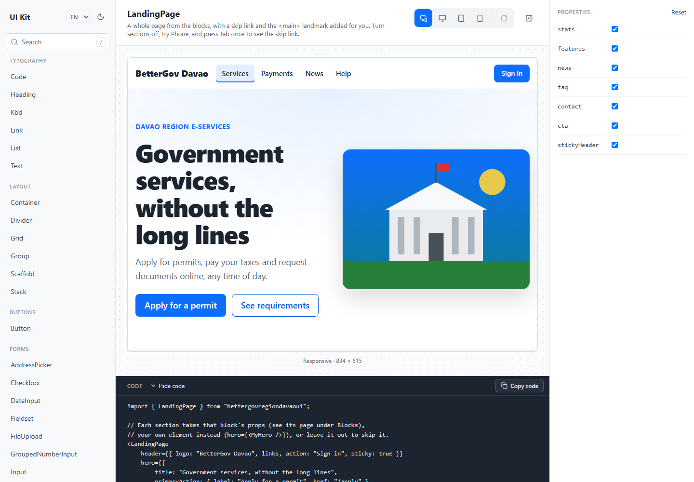
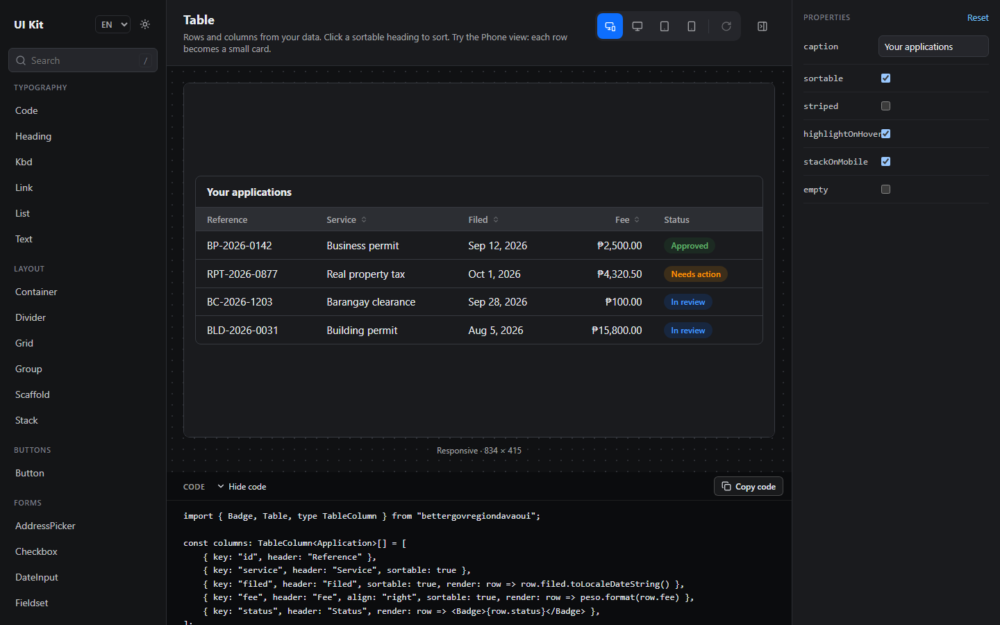

<div align="center">

# BetterGov UI

**Accessible React components and page blocks for Philippine government websites.**<br>
Made for BetterGov Region Davao: in English, Filipino and Bisaya, light on slow phones, ready for citizen services.

[](https://www.npmjs.com/package/bettergovregiondavaoui)
[](LICENSE)


[Quick start](#quick-start) · [What's inside](#whats-inside) · [Guides](#guides) · [Toolkit](#try-it-in-the-toolkit) · [Contributing](#contributing)

<br>

<picture>
    <source media="(prefers-color-scheme: dark)" srcset="docs/images/toolkit-dark.png">
    
</picture>

</div>

## Why BetterGov UI

Most UI kits are general-purpose. This one is made for one job: **public service websites in the Philippines**.

- 🏛️ **Made for citizen services.** Fields for PSGC addresses, +63 mobile numbers, pesos, PhilSys and TIN numbers.
  Blocks for services, advisories and office hours. Dates in local time and Philippine formats.
- 🗣️ **English, Filipino and Bisaya.** Every built-in text, including what screen readers say, in all three.
  One `LanguageProvider` switches them all.
- ♿ **Accessible by default.** Keyboard support, screen reader labels, real HTML landmarks, a skip link, readable
  contrast in light and dark mode, and less motion for people who ask for it.
- 📱 **Light for slow phones.** No dependencies besides React, and under 50 KB gzipped. It uses the browser's own
  date picker, dialogs and `<details>`, which work well on low-cost phones.
- ⚡ **A page in minutes.** `LandingPage` and 9 blocks, plus a toolkit to try everything on phone, tablet and desktop,
  and copy the code.

## Quick start

```bash
npm install bettergovregiondavaoui
```

It needs React 18 or newer, and works with Vite, Next.js and other React setups. It's still early (version 0.x),
so read the [changelog](CHANGELOG.md) when you update.

**1. Add the styles once,** in your app's entry file (for example `main.tsx` or your root layout):

```tsx
import "bettergovregiondavaoui/styles.css";
```

**2. Give the page the theme's colors,** so it matches the components:

```css
body {
    margin: 0;
    background: var(--surface);
    color: var(--text);
}
```

**3. Use the components:**

```tsx
import { Button, Container, Heading, MobileNumberInput, Stack, Text } from "bettergovregiondavaoui";

export function SignUp() {
    return (
        <Container as="main" size="sm">
            <form>
                <Stack gap="lg">
                    <Heading level={1}>Create an account</Heading>
                    <Text muted>It only takes a minute.</Text>
                    <MobileNumberInput name="mobile" required />
                    <Button type="submit" fullWidth>Continue</Button>
                </Stack>
            </form>
        </Container>
    );
}
```

## What's inside

### 48 components

| Group | Components |
|---|---|
| Typography | `Text`, `Heading`, `Link`, `List`, `Code`, `Kbd` |
| Layout | `Scaffold`, `Container`, `Stack`, `Group`, `Grid`, `Divider` |
| Buttons | `Button` |
| Forms | `Input`, `PasswordInput`, `Textarea`, `Select`, `Checkbox`, `Radio`, `Switch`, `DateInput`, `FileUpload`, `Fieldset` |
| Philippine fields | `AddressPicker`, `MobileNumberInput`, `PesoInput`, `PhilSysInput`, `TinInput`, `GroupedNumberInput` |
| Feedback | `Alert`, `Badge`, `Loader`, `Progress`, `Skeleton`, `StatusChecker`, `Toast` |
| Navigation | `Navbar`, `Tabs`, `Breadcrumbs`, `Pagination`, `Stepper` |
| Data display | `Table`, `Accordion`, `Card`, `Avatar`, `Tooltip` |
| Overlays | `Modal`, `Drawer` |

Some come with parts, like `Card` with `CardTitle` and `CardFooter`. The [components guide](docs/components.md) lists them all.

### 10 blocks

| Block | What it is |
|---|---|
| `LandingPage` | A whole page from the blocks below, with a skip link and the `<main>` landmark |
| `HeaderBlock` · `FooterBlock` | The top and bottom of a site; on phones the header's links fold into a ☰ menu |
| `HeroBlock` | The big opening section, with two buttons and an optional picture |
| `StatsBlock` · `FeaturesBlock` · `NewsBlock` | Numbers, a grid of services, the latest posts |
| `FaqBlock` · `ContactBlock` · `CtaBlock` | Questions and answers, office details with a map, a call to action |

## Guides

| Guide | What's in it |
|---|---|
| [Components](docs/components.md) | Every component and its parts, the props they share (`size`, `color`, `variant`, `as`), toasts |
| [Forms](docs/forms.md) | Reading values with `FormData` or state, errors, passwords, prefixes |
| [Philippine fields](docs/philippine-fields.md) | Mobile numbers, pesos, PhilSys, TIN, SSS, PhilHealth, Pag-IBIG, and the PSGC address picker |
| [Blocks](docs/blocks.md) | Ready-made sections and `LandingPage` |
| [Page layout](docs/layout.md) | `Scaffold` and semantic HTML |
| [Languages](docs/languages.md) | English, Filipino, Bisaya, and your own wording |
| [Theming](docs/theming.md) | Colors, corner radius, spacing and dark mode |
| [Accessibility](docs/accessibility.md) | What's built in, and the few things that are up to you |
| [Status checker](docs/status-checker.md) | Checking if websites are up, and what a browser can't tell |

## Try it in the toolkit

The toolkit has a page for every component and block. Change the props, preview it as a phone, tablet or desktop,
switch between light and dark and between English, Filipino and Bisaya, then copy the code.

```bash
git clone https://github.com/ProjectFuritsu/bettergovui.git
cd bettergovui
npm install
npm run dev
```

Then open http://localhost:5173.

<p align="center">
    
</p>

## Contributing

Help is welcome, especially:

- **Native speakers of Filipino and Bisaya**, to check the translations. They're all in one file, [`src/i18n/messages.ts`](src/i18n/messages.ts).
- **Screen reader users**, to try the components and tell us what's confusing.
- **Bug reports and ideas** for components that government services need.

See [CONTRIBUTING.md](CONTRIBUTING.md) to get started.

## License

[CC0 1.0 Universal](LICENSE): dedicated to the public domain. Anyone, including other government offices, may use,
change and share this kit, for any purpose, without asking.
